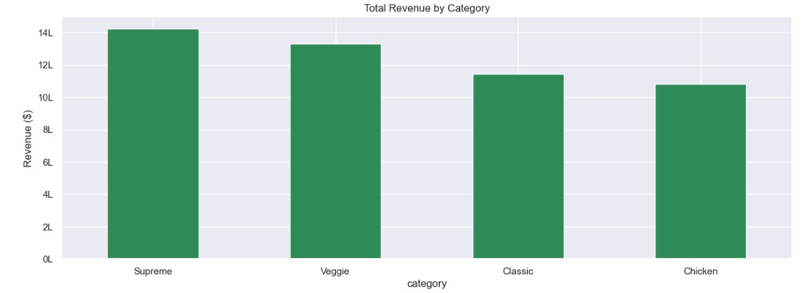

<div align="center">

# 🍕 Pizza Sales — Exploratory Data Analysis

**Turning messy raw sales data into clean insights using Python & Pandas**


</div>

---

## 📌 About This Project

A pizza restaurant's sales data was a mess — inconsistent date formats, typos
in categories, a price column mixing `$14.41` with `21.59` in the same
column, duplicate rows, and missing values everywhere.

This project takes that raw data, cleans it step by step, and turns it into
clear answers to simple business questions: *What sells the most? Which day
makes the most money? What's the average order worth?*

Built with fully commented walkthrough — every step
explains **what** was done and **why**, not just the code.

---

## 🗂️ The Dataset

Four raw files, joined into one clean table:

| File | What it contains |
|---|---|
| `orders.csv` | Order ID, date, and time of each order |
| `order_details.csv` | Which pizza was ordered, and how many |
| `pizzas.xlsx` | Pizza ID, size, and price |
| `pizza_types.xlsx` | Pizza name, category, and ingredients |

---

## 🧹 Data Cleaning — What Was Actually Wrong

| Problem Found | Fix Applied |
|---|---|
| Duplicate rows across all 4 files | Removed with `drop_duplicates()` |
| Dates in mixed formats + fake placeholder dates (`0000-00-00`, `1900-01-01`, `2099-01-01`) | Parsed with `pd.to_datetime()`, filtered to real order dates only |
| Price column mixing numbers and `"$14.41"`-style text | Stripped `$` and converted to a proper number |
| Size column had typos (`Xl`, `s`, `' M'`) | Standardized with `.str.strip().str.upper()` |
| Category column had typos (`Suprem`, `veggei`, `CHICKEN`) | Mapped to correct spelling and standardized casing |
| Missing pizza names | Dropped instead of using a placeholder — filling with "Unknown" would've wrongly merged different pizzas into one fake "best seller" (a real bug caught during this project) |

---

## 🔍 Key Insights

<div align="center">

| Metric | Value |
|---|---|
| 💰 Total Revenue | **$4,987,523** |
| 🧾 Total Orders | **68,520** |
| 🛒 Average Order Value | **$72.79** |
| 🏆 Best Category | **Supreme** |
| 🍕 Best-Selling Pizza | **The Napolitana Feast** |

</div>

**What the analysis showed:**
- Revenue stays fairly steady month to month — no single month dramatically outperforms the rest
- The **Supreme** category brings in the most revenue overall, not just the most orders
- Certain days of the week and hours of the day consistently bring in more revenue — useful for staffing decisions
- A large share of "messy" rows in the raw data were placeholder/junk values, not real orders — cleaning them out changed the final numbers meaningfully

```


```

---

## 🛠️ Tools & Libraries

- **Python** — core language
- **Pandas** — data loading, cleaning, merging, aggregation
- **Matplotlib & Seaborn** — visualizations
- **Jupyter Notebook** — analysis environment

---

## 📁 Project Structure

```
pizza-sales-eda/
├── data/
│   ├── orders.csv
│   ├── order_details.csv
│   ├── pizzas.xlsx
│   └── pizza_types.xlsx
├──  pizza_sales_eda.ipynb
├── images/
│   └── (chart screenshots)
└── README.md
```

---

## ▶️ How to Run This Yourself

1. Clone this repo
   ```bash
   git clone https://github.com/your-username/pizza-sales-eda.git
   ```
2. Install the required libraries
   ```bash
   pip install pandas matplotlib seaborn openpyxl jupyter
   ```
3. Open the notebook
   ```bash
   jupyter notebook notebooks/pizza_sales_eda.ipynb
   ```
4. Run all cells — the four data files should sit in the same folder the notebook reads from

---

## 🎯 What This Project Practiced

- Spotting and diagnosing real-world data quality issues
- Making — and documenting — clear decisions about how to handle missing/bad data
- Joining multiple related tables into one analysis-ready dataset
- Going from raw numbers to a plain-language business takeaway

---

## 🙋 About Me
Built by **Tabish Afzal** as a hands-on project to practice the real workflow of a Data Analyst: taking genuinely messy raw sales data, auditing it for quality issues, cleaning it with Pandas, and exploring it end to end to turn 68K+ raw orders into clear business insights.

· 🔗 [LinkedIn](https://www.linkedin.com/in/tabish-afzal/) · 💼 [Portfolio](https://github.com/tabish022)

---
⭐ If you found this useful, consider starring the repo!
